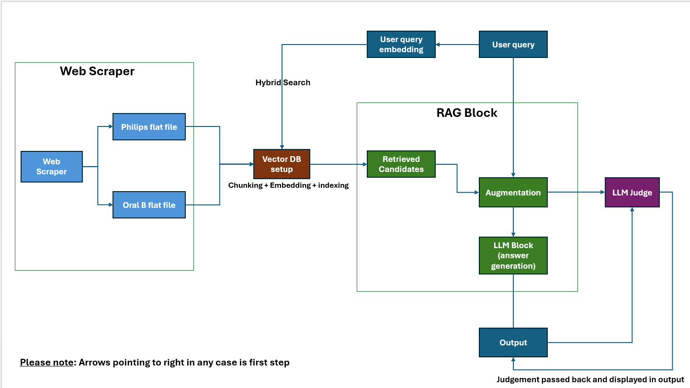

# Philips Sonicare vs Oral-B Product RAG System

## 1. Approach Summary

This project implements a Retrieval-Augmented Generation (RAG) system for answering questions about comparisons between Philips Sonicare and Oral-B electric toothbrush products using retrieved product evidence.

The overall flow is:

The pipeline has two main stages:

**Stage 1. Data acquisition & normalization** 

   - A Playwright-based Chromium scraper navigates provided sources and discovers product cards using DOM/CSS selectors,
   - Extracts model codes, prices, features, images and product URLs, then visits each product page to collect JSON-LD, metadata, ratings, descriptions, page sections, colors and technical specifications. 
   - Lazy-loaded content and specification accordions are expanded before extraction; values are normalized, products are deduplicated using product URL/model code, and checkpoints are saved after each product.
   - The final data is exported as JSON, JSONL and a flattened CSV

**Stage 2. Retrieval-Augmented Generation (RAG)**

   **Environment and model initialization**
   - Loads the Hugging Face API token from `.env`.
   - Uses Chroma as the vector database.
   - Uses `sentence-transformers/all-MiniLM-L6-v2` for embeddings.
   - Uses `meta-llama/Llama-3.1-8B-Instruct` through `HuggingFaceEndpoint` for language-model tasks.

**2.1 Vector database setup**
   
   - The ingestion pipeline loads the flattened Philips and Oral-B CSV files, validates the required columns, and converts each product into separate attribute-level LangChain Document objects. 
   - Each document stores product metadata such as brand, product name, attribute, source URL, and exact source snippet.
   - Long descriptions are split into overlapping chunks using RecursiveCharacterTextSplitter with a 500-character chunk size and 50-character overlap.
   - The documents are then embedded using sentence-transformers/all-MiniLM-L6-v2 and stored in a persistent Chroma collection (toothbrush_products).
   - Chroma database is built during ingestion so the vector store stays synchronized with the latest CSV data. This vector database is later used by the RAG pipeline for semantic similarity retrieval.

**2.2 Query planning**
   - The user's question is first converted into a structured `QueryPlan`.
   - The planner identifies the intent, operation, attribute, brands, products, requested attributes, and filters.
   - Supported intents include:
     - `lookup`
     - `comparison`
     - `ranking`
     - `filter`
     - `aggregation`
     - `general`
   - Numeric conditions such as price ranges are represented explicitly using filter operators.
   For queries like products with price range 99 dollar to 199 dollars

**2.3 Product-level structured retrieval**
   - A product catalog is constructed from the metadata stored in Chroma.
   - Ranking and filtering questions are handled using structured Python logic rather than relying only on semantic similarity.
   - Examples include:
     - highest customer rating
     - lowest price
     - most reviews
     - most brush modes
     - products within a price range
   - Brand and product filters are applied before evidence retrieval.

**2.4 Hybrid retrieval**
   - General and non-structured questions use both:
     - vector similarity search
     - BM25 keyword search
   - The two rankings are combined using Reciprocal Rank Fusion (RRF).
   - This provides both semantic and lexical retrieval signals.

**2.5 Evidence construction**
   - Retrieved documents are converted into an explicit evidence context.
   - Each evidence block contains:
     - `SOURCE_ID`
     - `DOCUMENT_ID` (to trace back the chunk)
     - Brand
     - Product
     - Attribute (as in what field)
     - `SOURCE_SNIPPET`
     - `SOURCE_URL`
     - source evidence
   - The exact `SOURCE_SNIPPET` and `SOURCE_URL` are exposed to the LLM so that citations and product links can be grounded in retrieved metadata.

**2.6 Answer generation**
   - The final answer prompt strictly instructs the model to use only retrieved evidence.
   - The expected output is a Markdown table with exactly eight columns:
     - Product Name
     - Brand
     - Feature (values)
     - Citation (evidence at row level)
     - Product Link

**2.7 Output validation**
   - **LLM-as-a-judge**: Generated answers was verified using another LLM block
   - **Citation** and **Product link** in outout provided acts as additional validation 

**2.8 Evaluation**
   
-  A fixed set of queries are used to evaluate few aspects of the assistant's response, namely
      - Relevance
      - Completeness 
      - Groundedness

## 2. Design Choices

### 2.1 Structured query planning

A query planner is used before retrieval so that questions requiring exact operations can be handled deterministically.

For example, a question such as:

> Which toothbrush is cheapest?

is represented as a ranking operation over `price of the product` using `min`.

Similarly:

> Which products cost between $100 and $200?

is represented as a filter with two conditions:

- price >= 100
- price <= 200

This avoids relying entirely on semantic retrieval for numerical comparisons.

### 2.2 Product-level catalog

Built a product-level catalog from Chroma metadata. Numeric attributes such as price, customer rating, review count, and brush mode count are converted into numeric Python values.

This allows ranking and filtering to be performed directly and consistently.

The approach also prevents the system from selecting a product based only on the semantic similarity of an individual document chunk.

### 2.3 Hybrid retrieval

For general questions, the system combines vector search with BM25.

- **Vector retrieval (or dense search)** is useful when the wording of the question differs from the wording in the source material.
- **BM25** provides keyword-based matching that can help when the exact product or attribute terminology is important.

**Reciprocal Rank Fusion** combines the two retrieval rankings without requiring the scores from the two retrieval systems to be directly comparable.

### 2.4 Attribute-aware retrieval

When the query planner identifies requested attributes, structured retrieval attempts to retrieve only documents associated with those attributes for the selected products.

This supports the requirement that the answer should not introduce unrelated attributes.

For example, a request about app connectivity should not automatically result in price or customer-rating information being added to the answer.

### 2.5 Strict evidence grounding

The answer prompt explicitly prohibits:

- using model knowledge
- guessing
- inferring missing features
- treating missing information as "No"
- inventing products or values
- mixing evidence between products
- inventing URLs

When evidence is unavailable, the required response is:

> Not found in the provided US sources.

This is intended to reduce unsupported claims.

### 2.6 Exact source snippets

The Citation column is required to contain the exact `SOURCE_SNIPPET` stored with the retrieved document.

This is stricter than asking the model to provide a general citation because it ties the citation directly to the source metadata used during ingestion.

The Product Link similarly uses the exact `SOURCE_URL` associated with the retrieved product evidence.

### 2.7 Fixed answer schema

The final response is constrained to a Markdown table with six columns.

This makes the output consistent and easier to evaluate programmatically. Each row represents a product-feature pair when multiple features are requested.

### 2.8 Separation of retrieval and generation

The system separates:

- query understanding
- retrieval
- evidence construction
- answer generation
- LLM-as-a-judge

This makes it easier to debug individual stages and reduces the chance that generation logic silently replaces retrieval logic.

## 3. Limitations

**3.1 Dependence on source data**

The assitant can only answer questions using information contained in the indexed product data.

If a product attribute is absent from the retrieved US sources, the system cannot reliably provide that information. It should instead return:

> Not found in the provided sources.

Therefore, answer quality is directly dependent on the completeness and accuracy of the source dataset.

**3.2 LLM query-planning errors**

The query planner is itself an LLM call. Although the response is validated against the `QueryPlan` schema, the model may still misunderstand ambiguous questions.

For example, a query could potentially be interpreted as either a comparison or a ranking depending on its wording.

The implementation includes a fallback to a `general` query plan when planner parsing fails, but this may reduce retrieval precision.

### 3.3 Retrieval errors

Hybrid retrieval does not guarantee that the correct document will always be retrieved.

Semantic similarity can return conceptually related documents that are not the most relevant evidence, while BM25 depends on lexical overlap.

The final answer can therefore only be as reliable as the retrieved evidence supplied to the generator.

### 3.4 LLM output compliance

Prompt instructions alone cannot guarantee perfect compliance.

The model may still:

- paraphrase a citation
- produce an incorrect Markdown table
- use an incorrect URL
- introduce unsupported information

### 3.5 Multiple LLM calls

The system uses an LLM for:
- Query planning 
- Answer generation. 
- LLM Judgement

Consequently, response time depends on the availability and latency of the Hugging Face inference endpoint.

## Possible optimization:
- Extend the existing judge (LLM-as-judge) logic to return all three judgments in one structured response (currently it is giving only relevance and just for test queries we are reutring completeness and groundedness)
- Furhter refinement on planning logic - Avoid planning calls for obvious queries. Use deterministic parsing for well-defined filters and rankings, with the LLM planner as a fallback for ambiguous questions.
- Reduce retrieved context: Currently we are retrieving up to 25 documents. Test a smaller limit, such as 8–10, and check answer quality against the evaluation set. Smaller context means less prompt processing and often faster responses.
- Caching repeated evaluation/comparison question can avoid hitting LLM multiple times for the same query